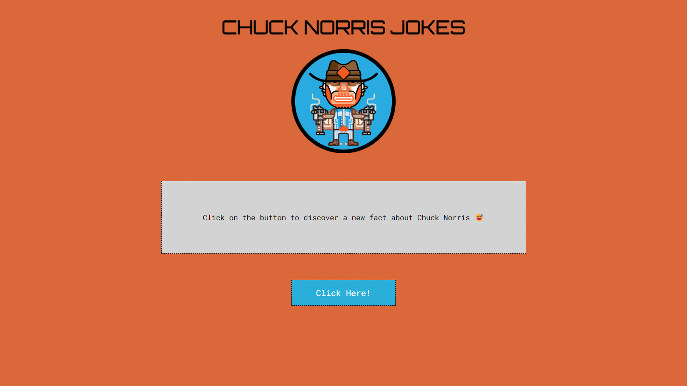

# Chuck Norris Jokes

  

## 📑 Description ##

This is a project that was made to use the ChuckNorris.io API.

The API is available on the following website: https://api.chucknorris.io/

## 🔗 Functions ##

The main functionality of this project is the consumption of an Application Programming Interface - API.

## 💻 Language and Tools ##

For the development of this project, the following languages and tools were used:

- [HTML](https://developer.mozilla.org/pt-BR/docs/Web/HTML)
- [CSS](https://developer.mozilla.org/pt-BR/docs/Web/CSS)
- [JavaScript](https://developer.mozilla.org/pt-BR/docs/Web/JavaScript)
- [Chucknorris.io](https://api.chucknorris.io/)

## 🚀 Deploy

Click on the link below to access the project 👇🏾

- [Chuck Norris Jokes](https://hrodrigomota.github.io/chuck-norris-jokes/)
